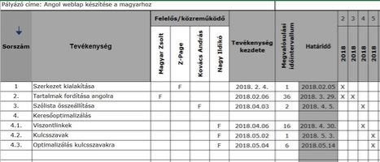
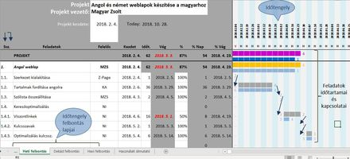

**Bevezetés**

A Gantt diagram egy nagyon hasznos és hatékony eszköz a projektek tervezésére és előrehaladásuk ellenőrzése során. Sokszor késztettem ilyet.

Általában egy Excel táblázatot használtam erre. A vízszintes sorokat a feladat megnevezése, a feladat kezdete, a feladat vége és az idő egységeire, például hónapokra osztva, az utóbbi cellákban általában egy "X" betű begépelésével jeleztem, hogy az így jelölt időintervallumban a feladat végrehajtása tart még. Azt hiszem ilyet mindenki készített, aki projektek menedzselésével foglalkozott. Ennek a módszernek a legnagyobb hátrány, hogy a táblázat elkészítése időigényes és az "X" betűk begépelése odafigyelést és szintén időt vesz igénybe. Erre mutat példát az alábbi kép:

A másik megoldás az Excel program Gantt diagram sablonjának használata. A sablonból sajnos hiányoznak a felelősök és nem biztos, hogy minden lehetőséget ki akarunk használni (pl. a tényleges kezdést és időtartamot). A sablon az időintervallumokat 1-60-ig számozza. Ezt is át kell írni pl. 1-12 hónapokra. Az előbbi példa így néz ki az Excel program sablonjában.

**Megoldás**

Ezeken a nehézségeken próbáltam segíteni amikor pár évvel ezelőtt kifejlesztettem egy viszonylag egyszerű Gantt diagram készítő Excel sablont. Ennek lényege az volt, hogy a feladatok kezdési idejének, és időtartamának megadása után a sablon képletei kiszámolják a feladat határidejét és az időtengelyen megrajzolják a feladat időtartamát ábrázoló vonalat. A projektek végrehajtása során pedig %-os formában megadható a feladatok előrehaladása, amely érték alapján a sablon képletei ismét egy másik színnel megrajzolják a fejlődést mutató csíkot a tervsáv alá. Ennek a sémának az időtengelye napi finomságú volt. Ebből következik, hogy egy több hetes, hónapos projekt áttekintése nehéz volt, mert sokat kellett görgetni a vízszintes tengelyen. Ettől függetlenül, sokan megvásárolták.

Az utóbbi hetekben továbbfejlesztettem a sablont. A fejlesztés kétirányú volt.

Az egyik, a tartalmi rész megoldotta a projekteknek legjobban megfelelő időtengely felbontást: a felhasználó választhat a napi, heti, dekád vagy havi felbontás között. A feladat hosszának kiszámításánál a képletek a hétvégeken kívül a munkaszüneti ünnepnapokat is figyelembe veszik. A napi pontosság a heti és dekád felbontásnál is úgy biztosított, hogy a csonka hetek és dekádok cellájában, az abban az időszakban a projekt feladatokra eső napok száma jelenik meg.

A másik fejlesztés a formaára helyezte a hangsúlyt. A jobb áttekintés kedvéért a napi, heti, dekád és havi felbontás különböző színekkel követik egymást. Ezen kívül az aktuális napot, hetet, dekádot vagy évet függőleges sárga csík jelzi. A lejárt határidők piros színben jelennek meg.

Az Excel sablon specifikációja a következő:

- a projekt feladatait, azok kezdő dátumát és időtartamát megadva a Gantt diagram automatikusan elkészül,
- a tevékenységek közötti kapcsolatok nyilakkal jelölhetők,
- az előrehaladás %-os bevitelével a Gannt diagram azt is megjeleníti,
- a lejárt határidők piros színnel jelennek meg,
- tervezhető fázisok, alprojektek száma: 5,

projektekhez tartozó feladatok száma: 30,

- időhorizont: 3 év,
- napi, dekád vagy havi nézet,
- a havi nézet az országos pályázatoknál megkövetelt formában is tervezhető,
- felesleges sorok és oszlopok egyszerűen törölhetők,
- nyelv: magyar vagy angol.

Az alábbi ábra a heti felbontású sablont mutatja be:

\

